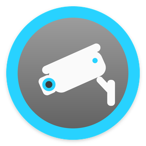
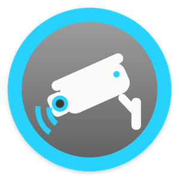
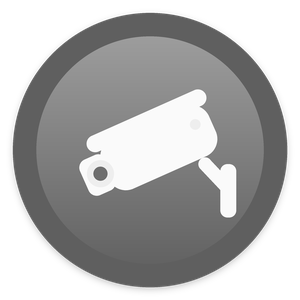
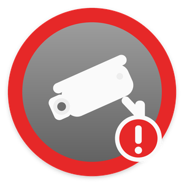
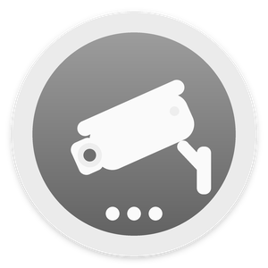

# DirectorLink · Hikvision for Control4

Free, open-source Control4 driver for Hikvision IP cameras and NVRs. Part of [DirectorLink Drivers](https://directorlink.io/drivers).

It works on your local network: the drivers talk straight to the cameras and NVRs, with no cloud, no extra hardware and no subscription.

Free. No subscription, no license key, no account with us.

Made by [DirectorLink](https://directorlink.io), the open-source management layer for Control4 homes. Works on its own: DirectorLink is not required.

**Download:** [latest release](../../releases/latest) · **Help and updates:** [directorlink.io/drivers/hikvision](https://directorlink.io/drivers/hikvision)

|  |  |  |  |  |
|:---:|:---:|:---:|:---:|:---:|
| Alerts on | Alert | Alerts off | Camera offline | Working |

## Features

| Feature | Control4 app | Programming |
|---|---|---|
| Find and add every camera | Nothing to do: cameras appear in their rooms, named | Hub actions: Search Network, Add New Cameras |
| Live video and snapshots | Camera view. The driver picks the H.264 stream that fits each screen | — |
| Detections: motion, person, vehicle, line crossing, intrusion, region entrance/exit, tamper, scene change, face, object left/removed, alarm inputs, PIR | — | Events, variables, conditionals and contacts on each camera |
| Alerts for people: any detection, people and vehicles, or people only | Notifications with a snapshot | *Alert* (camera) and *Camera Alert* (hub) events, `LAST_ALERT_*` variables |
| One alerts tile for the home | Tap to turn alerts on or off. The icon shows alert, off, snoozed or a camera offline | `SET_ALERTS`, `SNOOZE_ALERTS`, *Alerts On/Off* events |
| Camera controls | Inside the camera view: alerts, alert filter, snooze, motion detection, day/night, light, reboot | `SET_MOTION_DETECTION`, `SET_DAY_NIGHT`, `SET_LIGHT_MODE`, `SET_IMAGE`, `SET_ALARM_OUTPUT`, `REBOOT_CAMERA` |
| PTZ | Arrows and home in the camera view | `GOTO_PRESET` |
| Camera health | The tile shows a camera that is offline or refuses the login | *Camera Online/Offline* events, `ALL_ONLINE`, `CAMERAS_ONLINE` |

## Requirements

- **Control4 OS 3.2 or newer** and Composer Pro. Tested on OS 4.2.4.
- **Hikvision IP cameras and NVRs** with ISAPI, which covers almost all current models. Tested with AcuSense and ColorVu G2 cameras and a K-series NVR.
- The cameras on the controller's network. Other subnets and VLANs work too: see [Special cases](#special-cases).
- One login that works on the cameras. The admin account works.
- **H.264 on at least one stream.** Control4 cannot play H.265. The hub switches each camera's sub stream to H.264 when it adds it (hub setting **Sub Stream To H.264**, on by default).

## Installation

There are two drivers. Install both:

| Driver in Composer | File | What it does |
|---|---|---|
| **DirectorLink · Hikvision** | `DirectorLink-Hikvision.c4z` | Add it **once**. It finds every camera and NVR, adds them with one login, and gives the home one alerts tile. It shows in the project as **Hikvision Hub**. |
| **DirectorLink · Hikvision Camera** | `DirectorLink-Hikvision-Camera.c4z` | One per camera, added by the hub (or by hand). Video, detections, alerts, controls and programming. |

1. Download both `.c4z` files from the [latest release](../../releases/latest).
2. In Composer Pro: **Driver → Add or Update Driver or Agent**, once for each file.
3. Search **DirectorLink** and add **DirectorLink · Hikvision** to the room where new cameras should appear, for example a "Cameras" room.

> **Keep the exact file names.** If your browser saves a second copy as `DirectorLink-Hikvision (1).c4z`, rename it before you upload. Composer knows a driver by its file name, so a renamed copy installs as a separate driver instead of updating the one you have.

## Setup

### All cameras in three steps

1. **Enter the login once.** In the **Hikvision Hub** properties, set **Username** and **Password**. The hub searches the network. **Found On Network** shows what it found, for example *6 cameras, 1 NVR - 6 not added yet*.
2. **Add them.** Run **Actions → Add New Cameras**. The hub checks the login first, so a wrong password never adds unnamed cameras. Each camera is then added, named and configured, and **Status** counts them as it goes.
3. **Drag each camera to its room.**

A camera keeps the name it already has in Control4 (when it replaces another driver). Otherwise it takes its NVR channel name, for example "Garden" or "Front Gate", else the name shown on its video. The model and IP are a last resort.

Optional: add the **Hikvision Hub** to a room menu, for example *Security*, in Navigator settings, and rename it to something like **Camera Alerts** so the family knows what the tile does.

### Prepare the cameras

Do this on each camera's web page, or on the NVR:

- **Events.** For each detection you want in Control4 (Motion, Line Crossing, Intrusion, ...): enable it, set an arming schedule, and under **Linkage Method** tick **Notify Surveillance Center**.
- **H.264 video.** Control4 touchscreens and the app cannot play H.265, and many cameras ship with H.265 on every stream. With the hub's **Sub Stream To H.264** on **Automatic** (the default), every camera the hub adds switches its sub stream to H.264 by itself. The main stream, which the NVR records, is not touched. For other cameras run **Set Sub Stream To H.264** on the camera, or **Set All Sub Streams To H.264** on the hub. If a camera refuses, its **Attention** line says why.
- **Authentication.** *Configuration → System → Security → Authentication*: WEB Authentication **digest** or **digest/basic**. ISAPI must be on, under *Network → Advanced Settings → Integration Protocol*.

Each camera's **Attention** property says when one of these is missing.

### One camera without the hub

Add **DirectorLink · Hikvision Camera** to a room. On the camera's **Properties** page (Control4's camera page, the same for every camera) enter the **Address**, **Username** and **Password**, and the ports if they are not 80 and 554. The driver sets Digest authentication and the camera's RTSP port for you. For a camera behind an NVR, enter the NVR's address and set **Channel** under **Advanced Properties**.

### Alerts

**Detections** always fire their events, variables and contacts. Use them for automations, such as lights on when a person is detected at night.

**Alerts** are the part meant for people: the *Alert* and *Camera Alert* events, notifications, snapshots and the Control4 History. A detection becomes an alert when alerts are on for that camera **and** on the hub (its tile), are not snoozed, **and** the detection matches the camera's **Alert On**:

| Alert On | Alerts for |
|---|---|
| Any detection | everything the camera reports |
| People and vehicles | people and vehicles (AcuSense cameras), plus tamper and alarm inputs |
| People only | people (AcuSense cameras), plus tamper and alarm inputs |

### On the touchscreen

- **The hub's tile:** the icon shows alerts on, an alert, alerts off or snoozed, a camera offline, or working. Tap it to turn alerts on or off for the whole home.
- **Inside each camera view (Extras):**

| Section | Controls |
|---|---|
| Alerts | Alerts from this camera on/off · Alert on (any / people and vehicles / people only) · Snooze for 1 hour |
| Camera | Motion detection on/off · Day / night · Light (Smart, IR, White light, Off; on cameras with a light) |
| Maintenance | Reboot the camera |

The camera view itself (video, snapshots, PTZ arrows) is drawn by Control4. PTZ buttons appear on PTZ and motorized-zoom cameras.

### Special cases

- **NVRs:** the hub reads the NVR's channel list, with the login or a separate **NVR Username/Password**. Cameras that are also on the network directly are connected directly and named after their NVR channel. Cameras reachable only through the NVR are added as NVR channels. Such a camera shows as offline when the NVR reports its channel as disconnected.
- **Other subnets and VLANs:** discovery doesn't cross routers. List those cameras in the hub's **Extra Camera IPs** (`10.0.5.20, 10.0.5.21:8080`) and run **Search Network**.
- **New cameras later:** run **Search Network** and **Add New Cameras** again. Only new ones are added.
- **Not activated:** brand-new cameras must get a password first, with Hikvision SADP or their web page. The hub lists them as *not activated*.
- **Different passwords:** add those cameras by hand. The hub still watches them and includes them in alerts.
- **A camera you don't want:** list it in the hub's **Ignored Cameras** (`192.168.50.21`, or `192.168.50.10/3` for channel 3 of an NVR) and **Add New Cameras** skips it.
- **A camera that is off or removed:** set its **Camera Enabled** to **No**. The driver stops all requests, events and offline alarms, and the hub stops counting it. Or delete it.

### Settings

**Hikvision Hub**

| Property | |
|---|---|
| Status · Cameras · Found On Network | What the hub is doing; which cameras are online, disabled, offline, refuse the login or have no H.264 video; the last search |
| Username / Password | The login used for every camera |
| NVR Username / Password | Only if the NVR uses a different login |
| Camera Names | Automatic (default): existing Control4 name, then NVR channel name, then the camera's on-screen name, then model and IP · Camera names · Model and IP |
| Extra Camera IPs | Cameras the network search can't reach |
| Ignored Cameras | Cameras **Add New Cameras** skips: a camera IP, `NVR IP/channel`, or an NVR IP for all its channels |
| Sub Stream To H.264 | Automatic (default): cameras the hub adds switch their sub stream to H.264, so Control4 can play them. Choosing Automatic also applies it to cameras already added. Off: leave the cameras as they are. |
| Alerts · Default Alert On · Snapshot With Alerts | Master switch; Alert On for new cameras; snapshot for notifications |

**Actions:** Search Network · Add New Cameras · Update Camera Names · Apply Login To All Cameras · Set All Sub Streams To H.264 · Camera List

**Hikvision Camera**

| Property | |
|---|---|
| Camera Enabled · Channel | *No* stops all requests, events and offline alarms. Channel is 1, or the NVR channel. Address, ports and login are on the camera's **Properties** page. |
| Status · Attention · Camera · Video · Events · Managed By | Health in plain words, what to fix, model and firmware, streams, detections that send events, the managing hub |
| Alerts · Alert On · Hold Time (s) | This camera's alerts, the alert filter, how long detections stay active |
| Snapshot With Alerts · Record Alerts In History | Snapshot for notifications; Control4 History entries |
| Video Quality · Event Monitoring | Auto / High / Low; the live event connection |
| Contact State When Active · PTZ Speed · Log Level | Advanced |

**Actions:** Reconnect · Test Snapshot · Set Sub Stream To H.264 · Setup Report · Reboot Camera

## Programming examples

- **One notification for every camera.** On the hub: *When* **Camera Alert** → *Send notification* "`LAST_ALERT_TYPE` at `LAST_ALERT_CAMERA`" with the attachment **Snapshot from the camera that raised the alert**.
- **Alerts follow the alarm.** When the security system arms, run hub `SET_ALERTS On`. When it disarms, run `SET_ALERTS Off`. `SNOOZE_ALERTS` pauses alerts for a number of minutes.
- **Lights for people at night.** On a camera: *When* **Person Detected**, *if* it is dark, turn on the porch lights. This runs even when alerts are off.
- **Tell the installer.** On the hub: *When* **Camera Offline** → send a notification with `LAST_OFFLINE_CAMERA`.

### Reference

**Hikvision Hub**

- **Events:** Camera Alert · Camera Offline · Camera Online · Alerts On · Alerts Off · New Cameras Found
- **Variables:** `ALERTS_ENABLED` `ALERT_ACTIVE` `ALL_ONLINE` (BOOL) · `CAMERAS_TOTAL` `CAMERAS_ONLINE` (NUMBER) · `LAST_ALERT_CAMERA` `LAST_ALERT_TYPE` `LAST_ALERT_TIME` `LAST_OFFLINE_CAMERA` (STRING)
- **Conditionals:** Camera alerts are On/Off · An alert is Active/Clear · All cameras are Online · Last alert is &lt;type&gt;
- **Commands:** `SET_ALERTS` (On/Off/Toggle) · `SNOOZE_ALERTS` (minutes) · `SEARCH_NETWORK`
- **Notification attachments:** snapshot from the camera that raised the alert · live snapshot from that camera

**Hikvision Camera**

- **Events:** Alert · Motion Detected · Motion Ended · Person Detected · Vehicle Detected · Line Crossing · Intrusion Detected · Region Entrance · Region Exiting · Tamper Detected · Scene Change Detected · Face Detected · Object Left Behind · Object Removed · Alarm Input Active · Alarm Input Inactive · PIR Alarm · Camera Online · Camera Offline · Alerts On · Alerts Off
- **Variables:** `ONLINE` `ALERTS_ENABLED` `ALERT_ACTIVE` `MOTION` `PERSON` `VEHICLE` `LINE_CROSSING` `INTRUSION` `TAMPER` `ALARM_INPUT` `MOTION_DETECTION_ENABLED` (BOOL) · `LAST_DETECTION` `LAST_ALERT` `LAST_ALERT_TIME` (STRING)
- **Conditionals:** Camera is Online · Alerts are On · Alert is Active · Motion is Active · Active detection is &lt;type&gt; · Last alert is &lt;type&gt;
- **Commands:** `SET_ALERTS` · `SNOOZE_ALERTS` · `SET_ALERT_ON` · `SET_MOTION_DETECTION` · `SET_DAY_NIGHT` · `SET_LIGHT_MODE` · `SET_IMAGE` (brightness, contrast, saturation, sharpness) · `SET_ALARM_OUTPUT` · `GOTO_PRESET` · `REBOOT_CAMERA`
- **Contacts** (Connections → Control): Alert · Motion · Person · Vehicle · Line Crossing · Intrusion · Tamper · Alarm Input. Bind them to Control4 motion or contact sensor devices.

## Updating

1. Download the new `.c4z` files from the [latest release](../../releases/latest).
2. Check that the names are exactly `DirectorLink-Hikvision.c4z` and `DirectorLink-Hikvision-Camera.c4z`, not `... (1).c4z`.
3. **Driver → Add or Update Driver or Agent** for each. Cameras keep their settings, rooms and programming.

## Troubleshooting

| What you see | What to do |
|---|---|
| The hub finds nothing | The cameras must be on the controller's network. Put cameras on other subnets in **Extra Camera IPs**. Cameras on an NVR's PoE ports are found through the NVR. |
| "Could not add the camera driver" | Upload `DirectorLink-Hikvision-Camera.c4z` (Driver → Add or Update Driver or Agent), then run **Add New Cameras** again. |
| Camera status "Login failed" | Fix the login on the hub, or on the camera's **Properties** page. A wrong password costs one attempt only; the driver waits until the login changes, so the camera never locks. |
| Snapshots work, video doesn't | The camera has no H.264 stream. **Attention** says so and the hub's **Cameras** line lists it. Run **Set Sub Stream To H.264**. If the camera refuses, set the sub stream to H.264 on its web page. |
| "Offline - the camera on NVR channel N is not connected to the NVR" | The NVR answers but that camera doesn't. Check the camera and its cable. If it is gone for good, set **Camera Enabled** to **No**. |
| *Attention*: "The camera gives no snapshot" | The camera is off, or the camera behind the NVR is offline. If it is gone for good, set **Camera Enabled** to **No**. |
| No events | Check the camera's **Events** property: each detection needs *Notify Surveillance Center*. For *Alert* events, check that alerts are on. |
| Cameras named by model and IP | The hub couldn't log in to read names. Fix the login, then run **Update Camera Names**. Or name the channels on the NVR. |
| *Attention*: "Open the camera's Properties page and set..." | Control4 refused the automatic update of that page. Enter the listed values by hand, once. |
| No tile or no camera controls | Add the **Hikvision Hub** to a room menu, and refresh Navigator after installing or updating. |

For details, run **Setup Report** on a camera or **Camera List** on the hub, and set **Log Level** to *Debug*. The output appears in the Lua tab.

## Privacy

The driver talks only to the Hikvision cameras and NVRs on your home network. It sends nothing to DirectorLink and collects no usage data.

Camera logins stay in your Control4 project. Reports and logs never show passwords.

## Support

Community-supported, best effort. Report problems in [Issues](../../issues).

Please include the camera or NVR model and firmware, your Control4 OS version, each driver's **Driver Version**, the **Setup Report** and **Camera List** output, and the Lua tab with **Log Level** set to *Debug*. Remove addresses and names you don't want to share. Reports that a model works are welcome too. Security problems: see [SECURITY.md](SECURITY.md).

## Building from source

```
pip install lupa pillow
python tools/gen_hub_xml.py      # after editing tools/hub_driver.xml.in
python tools/make_icons.py       # after changing icons
cd tests && python test_xml.py && python test_hub.py && python test_camera.py && cd ..
python tools/build.py            # -> dist/DirectorLink-Hikvision.c4z, dist/DirectorLink-Hikvision-Camera.c4z, dist/SHA256SUMS.txt
```

| Path | Contents |
|---|---|
| `src/common/core.lua` | Shared core: logging, timers, variables and events, XML parser |
| `src/common/isapi.lua` | Shared ISAPI client: Digest/Basic login, lockout guard, one request at a time per device |
| `src/hub/` | Hub driver: `driver.lua`, `driver.xml` (generated), `www/` documentation and icons |
| `src/camera/` | Camera driver: `driver.lua`, `driver.xml`, `www/` documentation and icons |
| `tools/` | `build.py` (packages), `gen_hub_xml.py` + `hub_driver.xml.in` (hub XML), `make_icons.py` (icons) |
| `tests/` | `harness.py` (Lua 5.1 with a stubbed Control4 API), `test_xml.py`, `test_hub.py`, `test_camera.py` |
| `VERSION`, `docs/releases/` | The version, and the notes for each release |

`build.py` puts `src/common/*.lua` in front of each driver's `driver.lua` and stamps the version from `VERSION` (`1.0.0` → driver version `10000`, `1.2.3` → `10203`) and the build date into the packaged copies.

The tests run the real driver code in Lua 5.1. HTTP is answered in-process, and every Digest `Authorization` header is checked with RFC 2617 math. They cover discovery, NVR naming, adding and configuring cameras, the camera Properties page, a lost login, disabled and ignored cameras, offline NVR channels, master alerts, the alert filter, Extras, stream selection, the H.264 switch, the event stream parser, request queuing and the one-failed-login guarantee.

**How it works**

- **Discovery:** the hub joins `239.255.255.250:37020` (`C4:CreateNetworkConnection` + `NetConnect … "MULTICAST"`), sends the SADP `<Probe>` and parses the `<ProbeMatch>` replies. NVR channels come from `/ISAPI/ContentMgmt/InputProxy/channels`.
- **Adding:** `C4:AddDevice("DirectorLink-Hikvision-Camera.c4z", room, name, callback)`. The new camera then receives `DL_CONFIGURE` through `C4:SendToDevice`, which is not logged because it carries the password.
- **Camera Properties page:** address, ports and login live on Control4's camera page. Edits there reach the driver as `SET_ADDRESS`, `SET_HTTP_PORT`, `SET_RTSP_PORT`, `SET_USERNAME`, `SET_PASSWORD`, and the driver re-reads the page (`GET_PROPERTIES`) on every refresh. The page never shows the login back, so the driver keeps its own copy (password encrypted with `C4:PersistSetValue`). The hub writes the page with the same commands Composer uses; a hub-added camera that has no login asks the hub for it.
- **Hub ↔ camera messages:** `DL_CONFIGURE`, `DL_HUB_ALERTS`, `DL_HUB_HELLO`, `DL_FIX_SUBSTREAM` (hub → camera); `DL_CAMERA_STATUS`, `DL_CAMERA_ALERT` (camera → hub).
- **Video:** `GET_SNAPSHOT_QUERY_STRING` and `GET_RTSP_H264_QUERY_STRING` return `ISAPI/Streaming/channels/<ch>0<n>/picture` and `Streaming/Channels/<ch>0<n>`, choosing an H.264 stream that fits the requested width.
- **Events:** a TCP connection (`C4:CreateTCPClient`) to `/ISAPI/Event/notification/alertStream` with Digest login, chunked and multipart decoding, a `videoloss` heartbeat, a 120 s silence watchdog, and reconnects with 5–60 s backoff.
- **Requests** identify themselves with the User-Agent `DirectorLink-Hikvision/<version>` (hub) or `DirectorLink-Hikvision-Camera/<version>` (camera).

**Rules for new versions**

- `VERSION` is the only place the version is set.
- **Never rename** the `.c4z` files, and **never change or remove** proxy binding ids, the order of variables, event and command ids, or property names. Dealers' projects depend on them. Adding new ones is fine.
- Update `VERSION`, the change log in both `www/documentation.html` files, and `docs/releases/v<version>.md`. Then tag `v<version>`: GitHub Actions tests, builds and publishes the release with `SHA256SUMS.txt` (a pre-release for `-beta` versions).

## License and trademarks

[Apache License 2.0](LICENSE). See also [NOTICE](NOTICE).

Hikvision ISAPI behaviour was learned from the open-source projects [Home Assistant](https://github.com/home-assistant/core), [pyHik](https://github.com/mezz64/pyHik), [hikvision_next](https://github.com/maciej-or/hikvision_next), [Scrypted](https://github.com/koush/scrypted) and [openHAB](https://github.com/openhab/openhab-addons). No code was copied from them. Control4 interfaces follow the public [Snap One DriverWorks documentation](https://snap-one.github.io/docs-driverworks-fundamentals/). DirectorLink's own source code: [github.directorlink.io](https://github.directorlink.io).

Installing third-party drivers or changing a Control4 project can affect compatibility, support, warranty or recovery. Keep a backup of your project.

Apache License 2.0. Copyright 2026 DirectorLink. Not affiliated with or endorsed by Hikvision, Control4 or Snap One. Hikvision, Control4 and related names are trademarks of their respective owners.
